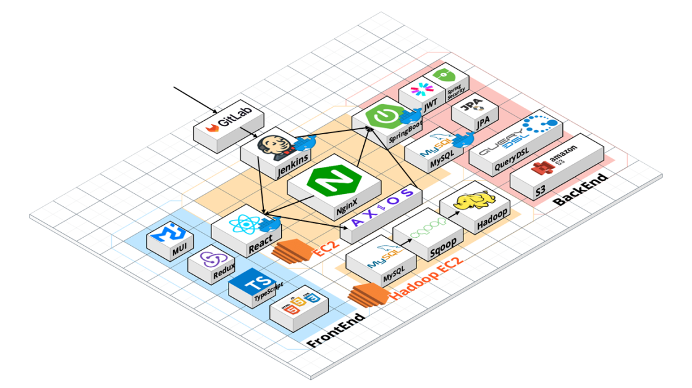
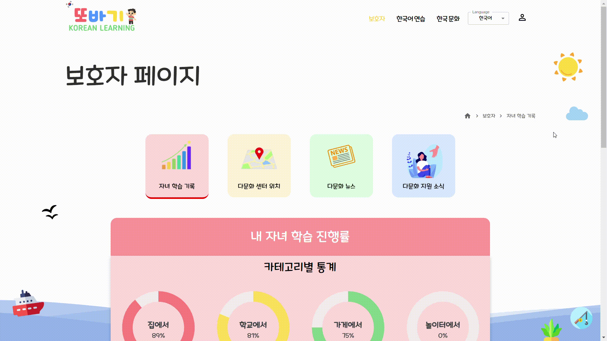
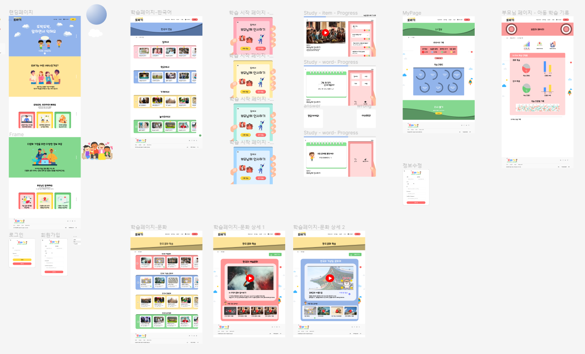
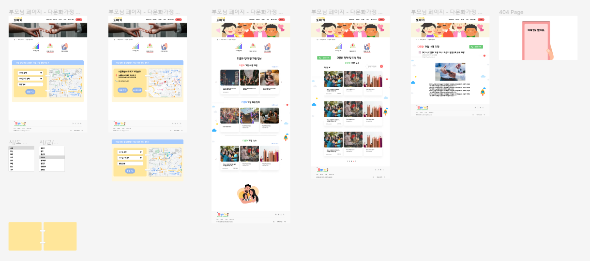
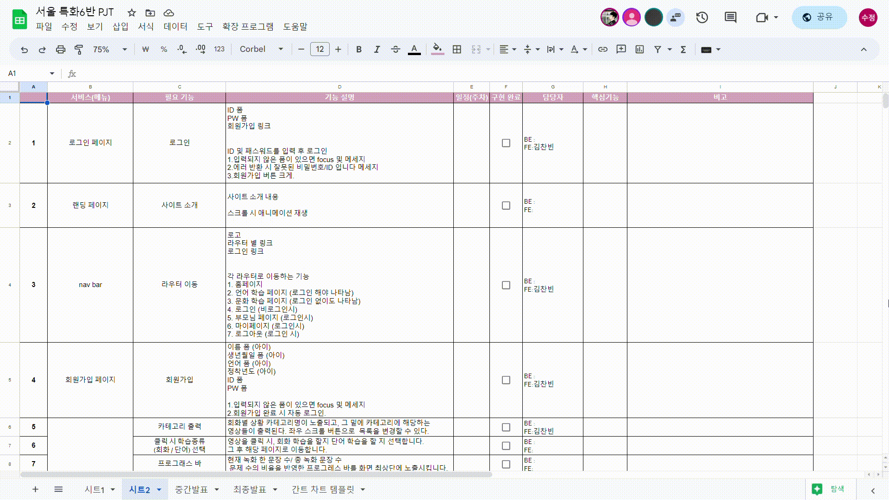
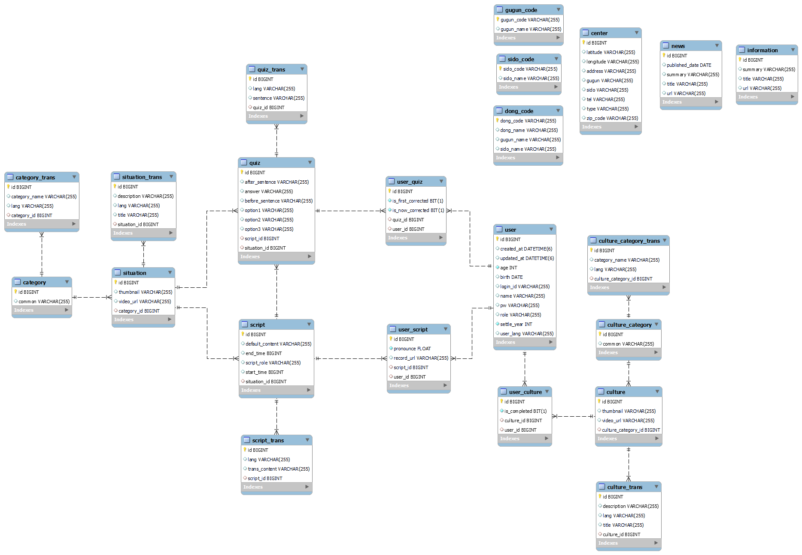
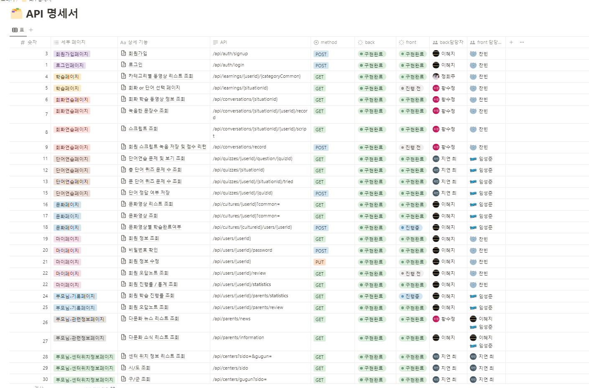

# ✏️또바기


### 프로젝트 진행 기간

2023.02.20(월) ~ 2023.04.07(금)


## 👓기획 배경
- 인구가 감소하는 저출산 사회 속에서 다문화 가정은 중요한 사회 구성원으로 자리잡고 있으나, 이들에게 적절한 사회적 지원이 제공되지 않고 있음.
- 이들 다문화 가정이 겪는 가장 큰 문제점으로는 고학력 사회인 한국에서의  자녀의 학업 문제.
- 한국어 습득의 정도에 따라 이후 제공되는 커리큘럼에서 불이익을 받기 때문임 
- 따라서 다문화 가정 아동들의 한국어 학습과, 그 부모님들이 아이들의 학습 지원을 원할히 할 수 있는 서비스를 기획함


## 🥅 개요

'또바기'는 한국에 거주하는 다양한 다문화 가정의 아이들이 영상을 따라하고, 따라한 문장의 단어를 학습하며 쉽고 빠르게 일상적인 한국어를 습득할 수  있도록 돕는 서비스입니다.


## 🎯 타겟
- 한국어 습득이 더딘 다문화 가정의 유치원~초등학교 저학년 수준의 아동
- 한국어 회화가 불가능한 중도입국자녀들 
- 이러한 아이들의 학습을 지도해야하는 선생님과 부모님


## Usage

````
git clone https://lab.ssafy.com/s08-bigdata-dist-sub2/S08P22A608.git

이후 exec폴더의 포팅메뉴얼을 따라 진행


````


## 개발환경


## 시스템 아키텍처




## CI/CD

- Jenkins, Docker를 이용하여 배포 자동화 시스템 구축
- 개발 서버와 운영 서버를 따로 구축
  - develop 브랜치 → 개발 서버 (dev)
  - master 브랜치 → 운영 서버 (prod)


### 📂디렉토리 구조

<details>
  <summary>
  백엔드 디렉토리 구조
  </summary>

      ddobagi
      ┣ api
      ┃ ┣ controller
      ┃ ┣ dto
          ┣ request
          ┗ response
      ┃ ┗ service
      ┣ common
      ┣ config
      ┣ db
      ┃ ┣ entity
      ┃ ┣ ┗ information
      ┃ ┗ repository
      ┗ ddobagiApplication.java
 </details>


<details>
  <summary>
  프론트엔드 디렉토리 구조
  </summary>

    FE
    ┣ public
    ┃ ┣ data
    ┃ ┣ img
    ┃ ┗ index.html
    ┣ src
    ┃ ┣ @ap.cx
    ┃ ┣ assets
    ┃ ┣ components
    ┃ ┃ ┣ animations
    ┃ ┃ ┣ Charts
    ┃ ┃ ┣ Culture
    ┃ ┃ ┣ Fullpage
    ┃ ┃ ┣ learning
    ┃ ┃ ┣ Map
    ┃ ┃ ┣ modal
    ┃ ┃ ┣ ParentPage
    ┃ ┃ ┣ Swiper
    ┃ ┃ ┗ Word
    ┃ ┣ container
    ┃ ┣ pages
    ┗ ┗ redux

</details>


## 주요기능 및 화면

#### 랜딩페이지


#### 로그인 & 로그아웃(jwt)

- 우측 상단에 로그인 버튼을 통해 로그인을 진행할 수 있습니다
- 로그인을 한 사용자만 서비스를 이용하기 위한 스튜디오를 생성할 수 있습니다.


#### 한국어 연습

- 한국어 연습 탭에 들어가면 카테고리 별 영상을 볼 수 있습니다.
- 영상을 선택하면 해당 영상을 통해 한국어 학습을 진행할 수 있습니다.


#### 한국어 연습 - 대화 연습

- 사용자가 선택한 영상을 통해 대화 연습을 할 수 있습니다.
- 전체 스크립트를 표시해 모든 대사를 볼 수 있고 스크립트 아래의 재생 버튼을 클릭하면 해당 부분의 영상이 재생됩니다.
- 녹음 버튼을 통해 녹음을 하면 발음 평가 점수 API를 통해 반환된 점수를 출력합니다.
- 확성기 버튼을 클릭하면 자신의 녹음을 다시 들을 수 있습니다.


#### 한국어 연습 - 단어 연습

- 사용자가 선택한 영상을 바탕으로 단어 연습을 진행할 수 있습니다.
- 재생 버튼을 클릭하면 해당 부분의 음성을 들어볼 수 있습니다.
- 빈칸에 알맞은 정답을 고르고 정답을 확인할 수 있습니다.


#### 한국 문화 학습

- 기념일, 전통, 문화예술, 음식 등의 카테고리를 통해 한국의 문화를 학습할 수 있습니다.
- 영상을 선택해서 들어가면 영상과 함께 설명을 확인할 수 있습니다.


#### 마이페이지

- 사용자의 활동 내역을 확인할 수 있습니다.
- 사용자의 학습 진행도를 확인할 수 있습니다.
- 틀렸던 문제만 모아서 다시 풀 수 있습니다.


#### 보호자 페이지 - 자녀 학습 기록

- 아이의 학습 통계와 다른 사용자들과의 비교 통계를 확인할 수 있습니다.




#### 보호자 페이지 - 다문화 센터 위치

- 전국의 다문화 센터 위치와 정보를 볼 수 있습니다.


#### 보호자 페이지 - 다문화 뉴스

- '다문화'가 제목이나 내용에 포함된 뉴스를 볼 수 있습니다.
- 클릭 시 해당 뉴스 페이지로 이동됩니다.


#### 보호자 페이지 - 다문화 지원 소식

- 다문화 가족에게 필요한 소식을 제공합니다.


## 🎨 화면 설계서

<a href="https://www.figma.com/file/BA3a3yKtxlXB9lLzRZOsI6/%EB%AA%A9%EC%97%85-%EB%B0%8F-%EC%99%80%EC%9D%B4%EC%96%B4%ED%94%84%EB%A0%88%EC%9E%84?node-id=2%3A3&t=pXWA3Yq5bmyOA1cF-1">
    
</a>
<a href="https://www.figma.com/file/BA3a3yKtxlXB9lLzRZOsI6/%EB%AA%A9%EC%97%85-%EB%B0%8F-%EC%99%80%EC%9D%B4%EC%96%B4%ED%94%84%EB%A0%88%EC%9E%84?node-id=2%3A3&t=pXWA3Yq5bmyOA1cF-1">
    
</a>

## 💭 요구사항 정의서

<a href="https://docs.google.com/spreadsheets/d/1j6hN3UW_iQyiBY1wCHxmRhKxvF29wjGXiwaEdRoH36E/edit#gid=1981292293">
    
</a>

## 🛢︎ ERD



## 📜 API 설계서

<a href="https://www.notion.so/984bc8788e794a3d96ca646551d56e2c?v=aea718149b354480b686056fa755340c&pvs=4">
    
</a>


## Team Members

<div align="left">
  <table>
    <tr>
        <td align="center">
        <a href="">
          
        </a>
      </td>
      <td align="center">
        <a href="">
          
        </a>
      </td>
      <td align="center">
        <a href="">
          
        </a>
      </td>
      <td align="center">
        <a href="">
          
        </a>
      </td>
      <td align="center">
        <a href="">
          
        </a>
      </td>
      <td align="center">
        <a href="">
          
        </a>
      </td>
    </tr>
    <tr>
      <td align="center">
        <a href="https://github.com/jiyeon5">
          최지연
        </a>
      </td>
      <td align="center">
        <a href="https://github.com/Rlack97">
          김찬빈
        </a>
      </td>
      <td align="center">
        <a href="https://github.com/leehyeji319">
          이혜지
        </a>
      </td>
      <td align="center">
        <a href="https://github.com/sssungjooon">
          임성준
        </a>
      </td>
      <td align="center">
        <a href="https://github.com/heeheejj">
          정희주
        </a>
      </td>
        <td align="center">
        <a href="https://github.com/sujunghwang">
          황수정
        </a>
      </td>
    </tr>
    <tr>
      <td align="center">
          팀장, BE
      </td>
      <td align="center">
          FE
      </td>
      <td align="center">
          BE
      </td>
      <td align="center">
          FE
      </td>
      <td align="center">
          BE, Infra
      </td>
      <td align="center">
          BE
      </td>
    </tr>
  </table>
</div>
