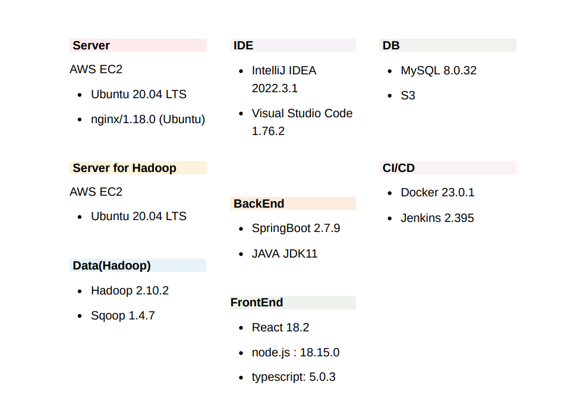
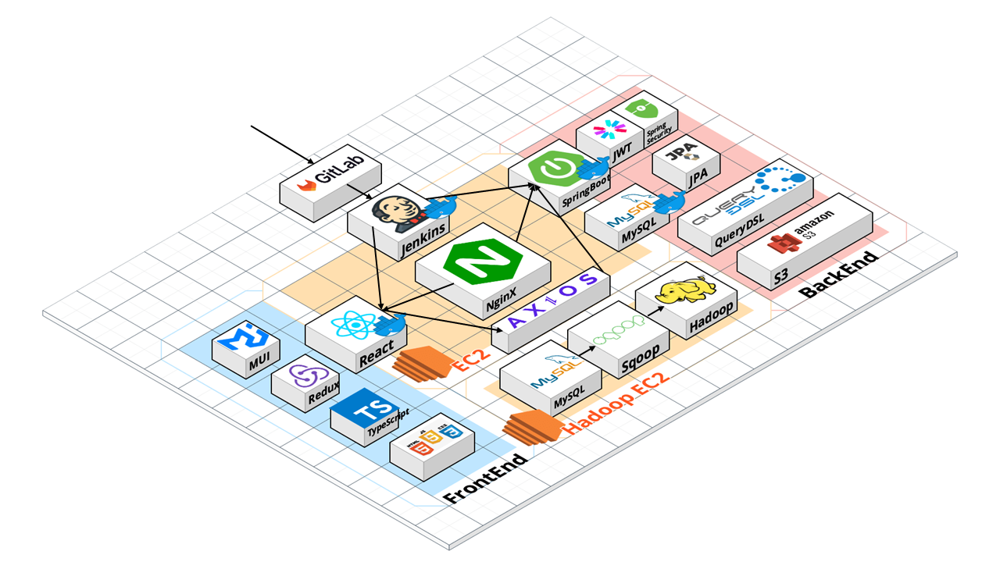
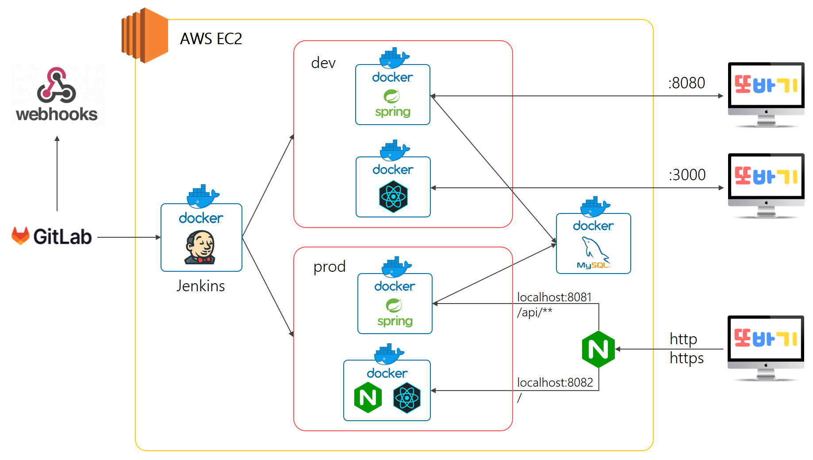
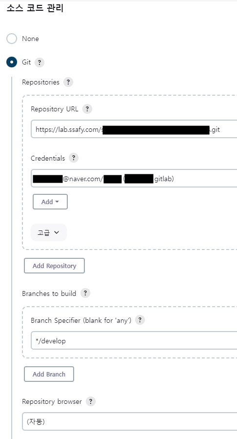
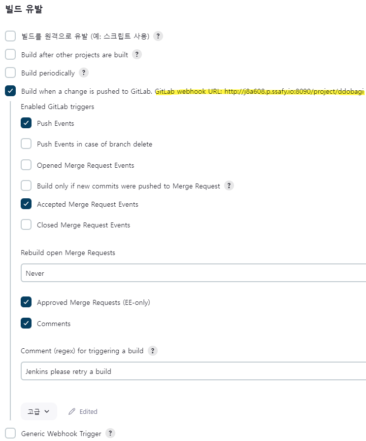
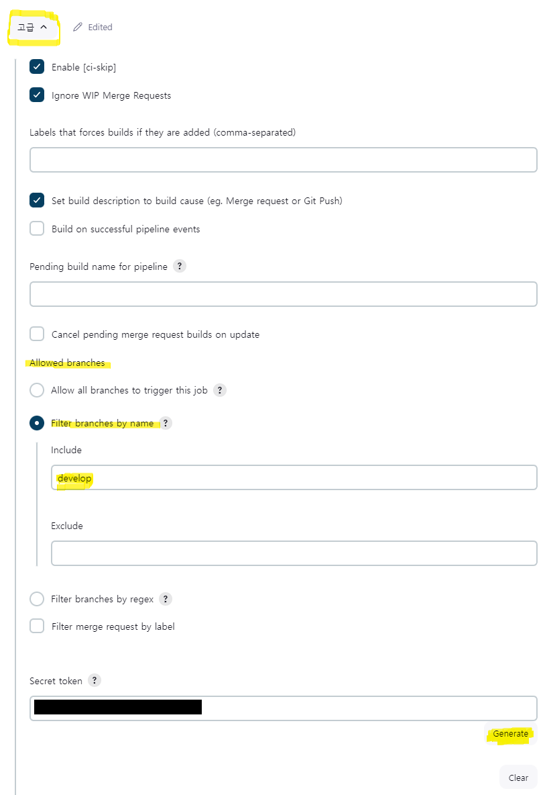
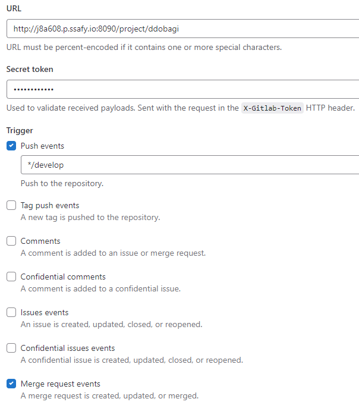
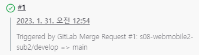

# Porting Manual


<br/>  


## 개발 환경




<br/>  

## System Architecture




<br/>  

<br/>  


## Contents

[1. CI/CD 설계](#1-cicd-설계)

- [개발서버와 운영서버](#개발서버와-운영서버)


- [CI/CD 구조도](#cicd-구조도)


- [포트 목록](#포트-목록)


[2. EC2 환경설정](#2-ec2-환경설정)

 - [Docker 설치](#docker-설치)

 - [MySQL 설치 및 설정](#mysql-설치-및-설정)

 - [Docker Network, Volume](#docker-network-volume)

 - [MySQL Docker Container](#mysql-docker-container)

 - [Jenkins Container](#jenkins-container)
   - [Jenkins Container 실행 및 기본설정](#jenkins-container-실행-및-기본설정)
   - [Docker in Docker: 젠킨스 컨테이너 안에 도커 설치](#docker-in-docker-젠킨스-컨테이너-안에-도커-설치)


[3. Jenkins GitLab 연동](#3-jenkins-gitlab-연동)

   - [3-1. Jenkins Item](#3-1-jenkins-item)

   - [3-2. Gitlab Webhooks 등록](#3-2-gitlab-webhooks-등록)

   - [3-3. Webhook Test](#3-3-webhook-test)

[4. 개발 서버](#4-개발-서버)

   - [React Frontend 빌드 및 배포: 개발 서버](#개발-서버-react-frontend-빌드-및-배포)
   - [SpringBoot Backend 빌드 및 배포: 개발 서버](#개발-서버-springboot-backend-빌드-및-배포)

[5. 운영 서버](#5-운영-서버)

   - [React Frontend 빌드 및 배포: 운영 서버](#운영-서버-react-frontend-빌드-및-배포)
   - [SpringBoot Backend 빌드 및 배포: 운영 서버](#운영-서버-springboot-backend-빌드-및-배포)
   - [NginX, certbot 설치 및 SSL 설정](#nginx-certbot-설치-및-ssl-설정)

[6. 외부 서비스](#6-외부-서비스)

   - [S3 설정](#s3-설정)
   - [AWS S3 Bucket 설정](#aws-s3-bucket-설정)

[참고: Docker 명령어](#docker-명령어)


<br/>  

<br/>  


## 1. CI/CD 설계

---

#### 개발서버와 운영서버

개발 서버와 운영 서버를 따로 구축하여, 개발 서버에서는 프론트엔드 개발자가 안정적으로 개발 및 테스트할 수 있는 환경을 제공하고, 

운영 서버에서는 실제 사용자들이 안정적으로 서비스를 이용할 수 있게 하여 개발의 효율과 서비스의 안정성을 높임

- develop 브랜치 → 개발 서버 (dev)

- master 브랜치 → 운영 서버 (prod)

<br/>  


#### CI/CD 구조도




<br/>  


#### 포트 목록

##### [ec2]

| 포트번호 | 설명 |
| :--- | ---- |
| 80 | http - https로 리다이렉트 |
| 443 | https |
| 3000 | 개발서버 React Docker Container |
| 8080 | 개발서버 SpringBoot Docker Container |
| 8081 | 운영서버 React, NginX Docker Container |
| 8082 | 운영서버 SpringBoot Docker Container |
| 8090 | Jenkins Docker Container |
| 3306 | MySQL Docker Container |


##### [ec2 for Hadoop]
| 포트번호 | 설명 |
| :--- | ---- |
| 9000 | Hadoop |
| 9870 | Hadoop Daemon |
| 10000 | Hive |
| 10001 | Hive http (외부접속) |
| 9083 | Hive metastore |
| 3306 | MySQL |


<br/>  

<br/>  


## 2. EC2 환경설정

---

#### Docker 설치

공식문서: https://docs.docker.com/engine/install/ubuntu/

참고 블로그: [[Docker] ubuntu에 docker 설치하는 방법](https://systorage.tistory.com/entry/Docker-ubuntu%EC%97%90-docker-%EC%84%A4%EC%B9%98%ED%95%98%EB%8A%94-%EB%B0%A9%EB%B2%95)


<br/>  


#### MySQL 설치 및 설정

`sudo apt install mysql-server` : mysql 설치

`sudo systemctl status mysql` : mysql 상태 확인

`docker exec -it mysql-container bash` : mysql bash 접속

`mysql -u root -p` : root 계정으로 접속

`create user '아이디'@'%' identified by '비밀번호';` : user 생성

`grant all privileages on **.** to '아이디'@'%';` : 권한 설정

`SHOW DATABASES;` : database 목록 조회

`CREATE DATABASE ddobagi;` : ‘ddobagi’라는 이름의 database 생성

`cd /etc/mysql/mysql.conf.d/  sudo vi mysqld.cnf` : bind-address를 0.0.0.0으로 변경하여 외부 접속 허용


<br/>  


#### Docker Network, Volume

- docker network, volume 생성

  ```bash
  docker network create ddobagi-net
  docker network create ddobagi-net
  ```

  
<br/>  


#### MySQL Docker Container

- docker container로 MySQL 배포

  ```bash
  docker run -dp 3939:3306 --network ddobagi-net --network-alias ddobagi-db  --mount type=volume,src=ddobagi-vol,target=/var/lib/mysql --env MYSQL_ROOT_PASSWORD={{루트 비밀번호}} --env MYSQL_DATABASE={{데이터베이스 이름}} --env MYSQL_USER=devs --env MYSQL_PASSWORD={{비밀번호}} mysql:latest
  ```

<br/>  


  

#### Jenkins Container

- ##### Jenkins Container 실행 및 기본설정

  - “jenkins/jenkins:latest-jdk11” 이미지를 이용해 도커 컨테이너 실행

    ```bash
    docker run -d -p 8090:8080 -v /var/jenkins_home:/var/jenkins_home -v /var/run/docker.sock:/var/run/docker.sock --name jenkins_real jenkins/jenkins:latest-jdk11
    ```

    - 옵션 설명
      - -d : docker container detach 모드로 실행
      - -p : container port를 host os의 port에 바인딩
      - -v : volume mount 설정 docker에서 관리하는 Volume을 통해서 host OS storage를 함께 사용
      - —name jenkins_real : 컨테이너의 이름을 jenkins_real로 설정한다. 안하면 random한 이름으로 컨테이너가 실행된다.
      - 

  - jenkins_real 컨테이너가 실행이 잘 되었는지 확인

    ```bash
    docker ps // 실행 중인 컨테이너 목록을 확인하는 명령어
    ```

  - jenkins 컨테이너를 docker network에 연결

    ```bash
    docker network inspect ddobagi-net
    ```

    

- ##### Docker in Docker: 젠킨스 컨테이너 안에 도커 설치

  - Jenkins container에 접속

    ```bash
    docker exec -itu 0 jenkins_real bash
    ```

  - bash command

    ```bash
    apt-get update && \
    apt-get -y install apt-transport-https \
         ca-certificates \
         curl \
         gnupg2 \
    		 zip \
         unzip \
         software-properties-common && \
    curl -fsSL https://download.docker.com/linux/$(. /etc/os-release; echo "$ID")/gpg > /tmp/dkey; apt-key add /tmp/dkey && \
    add-apt-repository \
       "deb [arch=amd64] https://download.docker.com/linux/$(. /etc/os-release; echo "$ID") \
       $(lsb_release -cs) \
       stable" && \
    apt-get update && \
    apt-get -y install docker-ce
    ```


<br/>  

<br/>  


## 3. Jenkins - GitLab 연동

---

#### 3-1. Jenkins Item

- `http://{서버_도메인}:8090` 으로 접속하면 젠킨스 대시보드를 확인할 수 있습니다.

- 기본 비밀번호는 Jenkins 서비스 최초 실행시 log로 확인할 수 있습니다.
  - `docker logs <container-id || container name>`

- Plugin 설치:  Jenkins 관리 → System Configuration → Plugin Manager → Available Plugin
  - Gitlab, Docker 관련 플러그인 모두 설치


개발서버용 item  하나, 운영서버용 item 하나 해서 두 개의 item을 생성합니다.

3-1번에서 3-3번까지의 과정을 마치고, branch 명 기입하는 부분을 master로 바꿔 한번 더 반복합니다.

변경되는 부분은 master 브랜치(운영 서버)와 develop 브랜치(개발 서버), 두 가지 경우 모두 기재해 두었습니다.

- Jenkins Item 생성: Free style project를 선택합니다.

- Jenkins Item 설정

  - 소스코드 관리: Git으로 설정

    ###### 

  - Repository URL 입력 -> ssh가 아닌 https url 입력

  - Credential 입력

    - Domain: Global credentials
    - Kind: Username with password
    - username & password : 깃랩 email & 비밀번호 입력, id는 X

  - Branches to build

    - 개발 서버의 경우: `*/develop` 라고 작성
    - 운영 서버의 경우: `*/master` 라고 작성

  - Build Trigger 설정

    ###### 

    ###### 

  - Build when a change is pushed to GitLab 체크

    - GitLab webhook URL: https://lab.ssafy.com/s08-bigdata-dist-sub2/S08P22A608.git

  - Enabled Gitlab trigger 중 선택

    - Push, Accepted Merge Request Events

  - 고급 → Filter branches by name → include

    - 개발 서버의 경우: `develop` 이라고 작성
    - 운영 서버의 경우: `master` 라고 작성

  - 고급 → Secret token → generate

    - generate한 secret token을 기억해 둘 것

- Build step 추가

  - Execute shell: Jenkins container 내에서 실행될 shell script 작성을 할 곳인데, 일단 지금은 넘어간다.


<br/>  


#### 3-2. Gitlab Webhooks 등록

- Trigger → Push events 부분에

  - 개발 서버의 경우: `*/develop` 이라고 작성

  - 운영 서버의 경우: `master` 라고 작성

###### 			

- Gitlab project → settings → Webhooks

  - URL : Jenkins 설정 시 확인한 GitLab webhook URL 입력

    `http://j8a608.p.ssafy.io:8090/project/ddobagi`

  - Trigger : 위에서 설정한 Trigger 설정

    push, Merge request events 두 개 체크

  - Add Webhook 클릭


<br/>  


#### 3-3. Webhook Test

test 후 build 확인

###### 


<br/>  


<br/>  


## 4. 개발 서버

---

#### 개발 서버 React Frontend 빌드 및 배포

Dockerfile, shell script(build.sh)는 gitlab repository에 포함되어 있습니다.

- /fe/ddobagi/Dockerfile

  ```dockerfile
  FROM node:16
  WORKDIR /react
  COPY package.json .
  RUN npm install
  RUN npm install typescript
  COPY . .
  EXPOSE 3000
  CMD [ "npm", "start" ]
  ```

- /fe/ddobagi/build.sh

  ```bash
  #!/usr/bin/env bash
  
  IMAGE_NAME="ddobagi-front-dev"
  CONTAINER_ID="$(docker container ls |grep ${IMAGE_NAME}|awk '{print $1}')"
  IMAGE_ID="$(docker images -q ${IMAGE_NAME})"
  EMPTY_STR=""
  echo "IMAGE : ${IMAGE_ID} "
  echo "CONTAINER : ${CONTAINER_ID}"
  echo "image build start"
  
  docker build -t ${IMAGE_NAME} .
  
  NEW_IMAGE_ID="$(docker images -q ${IMAGE_NAME})"
  
  echo "NEW_IMAGE_ID : ${NEW_IMAGE_ID}"
  
  echo "image build end "
  echo "container rm start"
  if [ "${CONTAINER_ID}" != "${EMPTY_STR}" ];then
  
          echo "container rm in start"
          docker rm -f ${CONTAINER_ID}
          echo "container rm in end"
  
  fi
  echo "conatiner rm end"
  
  echo "image rm start"
  if [ "${IMAGE_ID}" != "${EMPTY_STR}" ];then
          if [ "${IMAGE_ID}" != "${NEW_IMAGE_ID}" ];then
                  echo "image rm in start ${IMAGE_ID}"
                  docker image rm ${IMAGE_ID}
                  echo "image rm in end"
          fi
  fi
  echo "image rm end"
  
  echo "docker run start"
  docker run -dp 3000:3000 --mount type=bind,src=$(pwd)/src,target=/react/src --name ddobagi-front-dev ${IMAGE_NAME}
  echo "docker run end"
  ```

- [http://{도메인}:8090/](http://j8a608.p.ssafy.io:8090/) 에서 ddobagi→구성→소스 코드 관리→ 내려서 Build Steps에 Execute shell 추가

  ```bash
  cd /var/jenkins_home/workspace/ddobagi/fe/ddobagi
  sh build.sh
  ```

- 빌드

  ```bash
  # ~/fe/ddobagi 프론트 프로젝트 루트(Dockerfile이 있는 위치)에서 빌드
  docker build -t ddobagi-front-dev .
  ```

- 프론트엔드 컨테이너 run

  ```bash
  docker run -dp 3000:3000 --mount type=bind,src=$(pwd)/src,target=/react/src --name ddobagi-front-dev ddobagi-front-dev
  ```


<br/>  


#### 개발 서버 SpringBoot Backend 빌드 및 배포

Dockerfile, shell script(build.sh)는 gitlab repository에 포함되어 있습니다.

- /be/ddobagi/Dockerfile

  ```dockerfile
  FROM openjdk:11
  ARG JAR_FILE=build/libs/\*.jar
  COPY ${JAR_FILE} app.jar
  ENTRYPOINT ["java","-jar","/app.jar"]
  ```

- /be/ddobagi/build.sh

  ```bash
  #!/usr/bin/env bash
  
  IMAGE_NAME="ddobagi-backend-dev"
  CONTAINER_ID="$(docker container ls |grep ${IMAGE_NAME}|awk '{print $1}')"
  IMAGE_ID="$(docker images -q ${IMAGE_NAME})"
  EMPTY_STR=""
  echo "IMAGE : ${IMAGE_ID} "
  echo "CONTAINER : ${CONTAINER_ID}"
  echo "image build start"
  
  docker build -t ${IMAGE_NAME} .
  
  NEW_IMAGE_ID="$(docker images -q ${IMAGE_NAME})"
  
  echo "NEW_IMAGE_ID : ${NEW_IMAGE_ID}"
  
  echo "image build end "
  echo "container rm start"
  if [ "${CONTAINER_ID}" != "${EMPTY_STR}" ];then
  
          echo "container rm in start"
          docker rm -f ${CONTAINER_ID}
          echo "container rm in end"
  fi
  echo "conatiner rm end"
  
  echo "image rm start"
  if [ "${IMAGE_ID}" != "${EMPTY_STR}" ];then
          if [ "${IMAGE_ID}" != "${NEW_IMAGE_ID}" ];then
                  echo "image rm in start ${IMAGE_ID}"
                  docker image rm ${IMAGE_ID}
                  echo "image rm in end"
          fi
  fi
  echo "image rm end"
  
  echo "docker run start"
  docker run -dp 8080:8080 --name ddobagi-backend-dev --network ddobagi-net ddobagi-backend-dev
  echo "docker run end"
  ```

- `be/ddobagi/src/main/ && mkdir resources` : resources 디렉토리를 생성합니다.
   `sudo vi application.yml` : application.yml을 작성합니다. 작성 내용은 아래와 같습니다.

  ```yaml
  server:
    port: 8080
  
    servlet:
      context-path: /
      encoding:
        charset: utf-8
        enabled: true
  
  spring:
    datasource:
        url: jdbc:mysql://{{도메인}}:3306/ddobagi?useUnicode=true&characterEncoding=utf-8
  			username: {{사용자명}}
        password: {{비밀번호}}
        driver-class-name: com.mysql.cj.jdbc.Driver
    output.ansi.enabled: always
    jpa:
      hibernate:
        ddl-auto: create
        use-new-id-generator-mappings: false
      show-sql: false
      properties:
        hibernate:
          format_sql: true
      jpa:
        hibernate:
          ddl-auto: create
        properties:
          hibernate:
            format_sql: true
    jackson:
      serialization:
        write-dates-as-timestamps: false
      time-zone: Asia/Seoul
  ```

- [http://{도메인}:8090/](http://j8a608.p.ssafy.io:8090/) 에서 ddobagi→구성→소스 코드 관리→ 내려서 Build Steps에 Execute shell 추가

  ```bash
  cd /var/jenkins_home/workspace/<develop 브랜치와 연동한 jenkins item 이름>/be/ddobagi/
  sh gradlew clean
  sh gradlew build
  sh build.sh
  ```

- 빌드

  ```bash
  cd /var/jenkins_home/workspace/<develop 브랜치와 연동한 jenkins item 이름>/be/ddobagi/
  sh gradlew clean
  sh gradlew build
  ```

  ```bash
  # ~/be/ddobagi 백엔드 프로젝트 루트(Dockerfile이 있는 위치)에서 빌드
  docker build -t ddobagi-backend-dev .
  ```

- 백엔드 컨테이너 run

  ```bash
  docker run -dp 8080:8080 --name ddobagi-backend-dev --network ddobagi-net ddobagi-backend-dev
  ```


<br/>  


<br/>  


## 5. 운영 서버

---

#### 운영 서버 React Frontend 빌드 및 배포

  운영 서버에서는 프론트 프로젝트를 Nginx 까지 dockerizing하고 host NGINX에서 port forwading 하는 방식으로 배포합니다.
  
  Dockerfile_prod, shell script(build_prod.sh)는 gitlab repository에 포함되어 있습니다.

  - /fe/ddobagi/Dockerfile_prod
  
    ```dockerfile
    # syntax=docker/dockerfile:1
    FROM node:18 AS build
    WORKDIR /ddobagi
    COPY package.json .
    RUN npm install
    RUN npm install typescript
    COPY . .
    RUN npm run build
    
    FROM nginx:alpine
    COPY --from=build /ddobagi/build /usr/share/nginx/html
    ```
  
  - /fe/ddobagi/build_prod.sh
  
    ```bash
    #!/usr/bin/env bash
    
    IMAGE_NAME="ddobagi-front-prod"
    CONTAINER_ID="$(docker container ls |grep ${IMAGE_NAME}|awk '{print $1}')"
    IMAGE_ID="$(docker images -q ${IMAGE_NAME})"
    EMPTY_STR=""
    echo "IMAGE : ${IMAGE_ID} "
    echo "CONTAINER : ${CONTAINER_ID}"
    echo "image build start"
    
    docker build -t ${IMAGE_NAME} -f Dockerfile_prod .
    
    NEW_IMAGE_ID="$(docker images -q ${IMAGE_NAME})"
    
    echo "NEW_IMAGE_ID : ${NEW_IMAGE_ID}"
    
    echo "image build end "
    echo "container rm start"
    if [ "${CONTAINER_ID}" != "${EMPTY_STR}" ];then
    
            echo "container rm in start"
            docker rm -f ${CONTAINER_ID}
            echo "container rm in end"
    fi
    echo "conatiner rm end"
    
    echo "image rm start"
    if [ "${IMAGE_ID}" != "${EMPTY_STR}" ];then
            if [ "${IMAGE_ID}" != "${NEW_IMAGE_ID}" ];then
                    echo "image rm in start ${IMAGE_ID}"
                    docker image rm ${IMAGE_ID}
                    echo "image rm in end"
            fi
    fi
    echo "image rm end"
    
    echo "docker run start"
    docker run -dp 8082:80 --mount type=bind,src=$(pwd)/src,target=/ddobagi/src --name ddobagi-front-prod ${IMAGE_NAME}
    echo "docker run end"
    ```
  
  - [http://{도메인}:8090/](http://j8a608.p.ssafy.io:8090/) 에서 ddobagi→구성→소스 코드 관리→ 내려서 Build Steps에 Execute shell 추가
  
    ```bash
    cd /var/jenkins_home/workspace/<master branch와 연동한 jenkins item 이름>/fe/ddobagi
    sh build_prod.sh
    ```
  
  - docker image 빌드
  
    ```bash
    # ~/fe/ddobagi 프론트 프로젝트 루트(Dockerfile이 있는 위치)에서 빌드
    docker build -t ddobagi-front-prod -f Dockerfile_prod .
    ```
  
  - 프론트엔드 컨테이너 run
  
    ```bash
    docker run -dp 8082:80 --mount type=bind,src=$(pwd)/src,target=/ddobagi/src --name ddobagi-front-prod ddobagi-front-prod
    ```

<br/>  
    
  
  #### 운영 서버 SpringBoot Backend 빌드 및 배포
  
  Dockerfile_prod, shell script(build_prod.sh)는 gitlab repository에 포함되어 있습니다.
  
  - /be/ddobagi/Dockerfile_prod
  
    ```dockerfile
    FROM openjdk:11
    EXPOSE 8081
    ARG JAR_FILE=build/libs/\*.jar
    COPY ${JAR_FILE} app.jar
    ENTRYPOINT ["java","-jar","/app.jar"]
    ```
  
  - /be/ddobagi/build_prod.sh
  
    ```bash
    #!/usr/bin/env bash
    
    IMAGE_NAME="ddobagi-backend-prod"
    CONTAINER_ID="$(docker container ls |grep ${IMAGE_NAME}|awk '{print $1}')"
    IMAGE_ID="$(docker images -q ${IMAGE_NAME})"
    EMPTY_STR=""
    echo "IMAGE : ${IMAGE_ID} "
    echo "CONTAINER : ${CONTAINER_ID}"
    echo "image build start"
    
    docker build -t ${IMAGE_NAME} -f Dockerfile_prod .
    
    NEW_IMAGE_ID="$(docker images -q ${IMAGE_NAME})"
    
    echo "NEW_IMAGE_ID : ${NEW_IMAGE_ID}"
    
    echo "image build end "
    echo "container rm start"
    if [ "${CONTAINER_ID}" != "${EMPTY_STR}" ];then
    
            echo "container rm in start"
            docker rm -f ${CONTAINER_ID}
            echo "container rm in end"
    fi
    echo "conatiner rm end"
    
    echo "image rm start"
    if [ "${IMAGE_ID}" != "${EMPTY_STR}" ];then
            if [ "${IMAGE_ID}" != "${NEW_IMAGE_ID}" ];then
                    echo "image rm in start ${IMAGE_ID}"
                    docker image rm ${IMAGE_ID}
                    echo "image rm in end"
            fi
    fi
    echo "image rm end"
    
    echo "docker run start"
    docker run -dp 8081:8081 --name ddobagi-backend-prod --network ddobagi-net ddobagi-backend-prod
    echo "docker run end"
    ```
  
  - `be/ddobagi/src/main/ && mkdir resources` : resources 디렉토리를 생성합니다.
     `sudo vi application.yml` : application.yml을 작성합니다. 작성 내용은 아래와 같습니다.
  
    ```yaml
    server:
      port: 8081
    
      servlet:
        context-path: /
        encoding:
          charset: utf-8
          enabled: true
    
    spring:
      datasource:
          url: jdbc:mysql://{{도메인}}:3306/ddobagi?useUnicode=true&characterEncoding=utf-8
    			username: {{사용자명}}
          password: {{비밀번호}}
          driver-class-name: com.mysql.cj.jdbc.Driver
      output.ansi.enabled: always
      jpa:
        hibernate:
          ddl-auto: create
          use-new-id-generator-mappings: false
        show-sql: false
        properties:
          hibernate:
            format_sql: true
        jpa:
          hibernate:
            ddl-auto: create
          properties:
            hibernate:
              format_sql: true
      jackson:
        serialization:
          write-dates-as-timestamps: false
        time-zone: Asia/Seoul
    ```
  
  - [http://{도메인}:8090/](http://j8a608.p.ssafy.io:8090/) 에서 ddobagi→구성→소스 코드 관리→ 내려서 Build Steps에 Execute shell 추가
  
    ```bash
    cd /var/jenkins_home/workspace/<master branch와 연동한 jenkins item 이름>/be/ddobagi
    sh gradlew clean
    sh gradlew build
    sh build_prod.sh
    ```
  
  - 빌드
  
    - .jar file 빌드
  
      ```bash
      cd /var/jenkins_home/workspace/<master branch와 연동한 jenkins item 이름>/be/ddobagi/
      sh gradlew clean
      sh gradlew build
      ```
  
    - docker image 빌드
  
      ```bash
      # ~/be/ddobagi 위치(Dockerfile이 있는 위치)에서 빌드
      docker build -t ddobagi-backend-prod -f Dockerfile_prod .
      ```
  
  - 백엔드 컨테이너 run
  
    ```bash
    docker run -dp 8081:8081 --name ddobagi-backend-prod --network ddobagi-net ddobagi-backend-prod
    ```
  


<br/>  


#### NginX, certbot 설치 및 SSL 설정

- NginX 설치 및 설정

  ```bash
  #설치
  sudo apt update
  sudo apt install nginx
  
  #실행
  sudo systemctl start nginx
  #상태조회
  sudo systemctl status nginx
  
  #시스템 재시작시 자동으로 구동
  sudo systemctl enable nginx
  ```

  성공 시, 도메인 주소로 접속했을 때 `Welcome to nginx!` 를 확인할 수 있습니다.

- `j8a608.p.ssafy.io.conf` `(도메인.conf)` 작성

  `sudo vim /etc/nginx/sites-available/j8a608.p.ssafy.io.conf`

  ```bash
  # /etc/nginx/sites-available/j8a608.p.ssafy.io.conf
  
  server {
      if ($host = j8a608.p.ssafy.io) {
          return 301 https://$host$request_uri;
      } # managed by Certbot
  
   #80포트로 받을 때
    listen 80;
    server_name j8a608.p.ssafy.io www.j8a608.p.ssafy.io; # 없을경우 localhost
    return 301 https://j8a608.p.ssafy.io$request_uri;
  }
  
  server { #443포트로 받을 때
      listen [::]:443 ssl ipv6only=on; # managed by Certbot
      listen 443 ssl; # managed by Certbot
  
      server_name j8a608.p.ssafy.io www.j8a608.p.ssafy.io; # 없을경우 localhost
      ssl_certificate /etc/letsencrypt/live/j8a608.p.ssafy.io/fullchain.pem; # managed by Certbot
      ssl_certificate_key /etc/letsencrypt/live/j8a608.p.ssafy.io/privkey.pem; # managed by Certbot
      include /etc/letsencrypt/options-ssl-nginx.conf; # managed by Certbot
      ssl_dhparam /etc/letsencrypt/ssl-dhparams.pem; # managed by Certbot
  
    location / {
      proxy_pass http://localhost:8082;
  
      # 404 error
      try_files $uri $uri/ /index.html =404;
      
      # 프록시 버퍼 설정 - no 502 errors!
      proxy_buffer_size          128k;
      proxy_buffers              4 256k;
      proxy_busy_buffers_size    256k;
  
    }
  
    location /api { # location 이후 특정 url을 처리하는 방법을 정의
      add_header 'Access-Control-Allow-Origin' '*'; # CORS 관련 설정을 nginx 에서도 할 수 있다.
  
      proxy_pass http://localhost:8081; # Request에 대해 어디로 리다이렉트하는지
      proxy_redirect off;
      charset utf-8;
      
      proxy_http_version 1.1;
      proxy_set_header Connection "upgrade";
      proxy_set_header Upgrade $http_upgrade;
      proxy_set_header Host $http_host;
      proxy_set_header X-Real-IP $remote_addr;
      proxy_set_header X-Forwarded-For $proxy_add_x_forwarded_for;
      proxy_set_header X-Forwarded-Proto $scheme;
      proxy_set_header X-NginX-Proxy true;
      
      # 프록시 버퍼 설정 - no 502 errors!
      proxy_buffer_size          128k;
      proxy_buffers              4 256k;
      proxy_busy_buffers_size    256k;
  
    }
  }
  ```

- NginX 서버가 읽는 사이트 활성화 directory에 연결

  `sudo ln -s /etc/nginx/sites-available/i8a810.p.ssafy.io /etc/nginx/sites-enabled/`

- Cerbot 설치 및 SSL 인증서 발급

  ```bash
  sudo snap install certbot --classic
  sudo certbot --nginx -d j8a608.p.ssafy.io
  ```

- NginX 재시작

  ```bash
  sudo nginx -t
  sudo service nginx restart
  ```

- 크롬 주소창에 도메인 입력하여 확인

  

<br/>  


<br/>  

## 6. 외부 서비스

#### S3 설정
1. https://www.aws.amazon.com/ 에 가입 후 S3로 이동
2. 프로젝트에 사용할 버킷을 생성
3. 버킷 이름, 리전, 퍼블릭 액세스 설정
4. IAM 에서 사용자 생성 후 AmazonS3FullAccess 권한 부여
5. 생성한 사용자의 AccessKey와 SecretKey를 발급 받고 프로젝트에 적용

#### AWS S3 Bucket 설정
1. 버킷 정책

    ```json
    {
      "Version": "2012-10-17",
      "Statement": [
        {
          "Sid": "PublicReadGetObject",
          "Effect": "Allow",
          "Principal": "*",
          "Action": "s3:GetObject",
          "Resource": "arn:aws:s3:::ddobagi/*"
        }
      ]
    }
    ```

2. ACL

    - 버킷 소유자
      - 객체 : 나열, 쓰기, 읽기
      - 버킷 ACL : 읽기, 쓰기
    - 버킷 소유자
      - 객체 : 읽기
      - 버킷 ACL : 읽기

3. CORS

    ```json
    [
      {
        "AllowedHeaders": [
          "*"
        ],
        "AllowedMethods": [
          "HEAD",
          "GET",
          "PUT",
          "POST",
          "DELETE"
        ],
        "AllowedOrigins": [
          "*"
        ],
        "ExposeHeaders": [
          "ETag",
          "x-amz-meta-custom-header"
        ]
      }
    ]
    ```
  
<br/>  


<br/>  


## Docker 명령어

---

`docker run [옵션] {{image}}` : 도커 실행하기

`docker ps` : 실행중인 컨테이너 목록 확인

`docker ps -a` : 모든 컨테이너 목록 확인, container name을 확인할 수 있다

`docker stop {{container-id}}` : 컨테이너 중지 (컨테이너 ID를 입력할 때, 앞부분이 겹치지 않는다면 1-2자만 입력해도 됨)

`docker rm {{container-id}}` : 컨테이너 삭제

`docker images` : 이미지 목록 확인

`docker logs {{container-id}}` : 컨테이너 로그 확인


<br/>  

<br/>  


